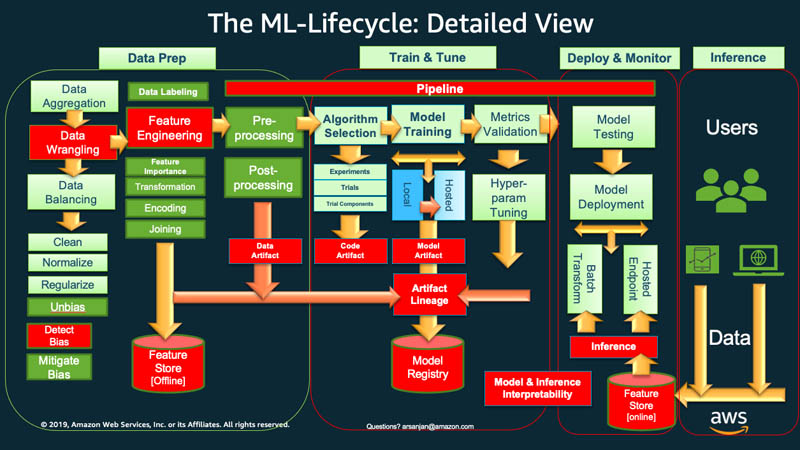
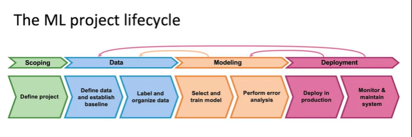

# Wellcome to Mlops Class1
## Agenda
- Introduction to Mlops
- Introduction to Devops

## Introduction to Mlops
- Mlops is a combination of Machine Learning and Devops.
- Mlops stands for Machine Learning Operations.
- MLops is set of practies to design, build, deploy, and manage machine learning models in production consistently, reliably and efficiently.
- Mlops is a practice for collaboration and communication between data scientists and operations professionals to help manage the production ML lifecycle.

## Life Cycle of Mlops
- Data Collection
- Data Preprocessing
- Model Building
- Model Training
- Model Testing
- Model Deployment
- Model Monitoring
- Model Optimization
- Model Re-Training
- Model Decommissioning
#bold horizantal line with 3 dashes

```yaml
Life Cycle of Mlops is shown in below picture By AWS
``` 
- 
```yaml
Life Cycle of Mlops is shown in below picture By deeplearning.ai
```
- 

# Mlops vs Data Science
- Data Science is a process of deriving insights from the data. 
- Mlops is a process of deploying the model in production. 
- Data Science is a process of building the model.
- Mlops is a process of managing the model in production.

# Mlops REquirements to learn 
- Python Programming
- Machine Learning(ML Algorithms)
- Deep Learning(DL Algorithms)
- Cloud Computing(AWS, Azure, GCP)
- Docker (Containerization)
- Kubernetes (Orchestration)
- Jenkins (CI/CD)
- Git (Version Control)
- Linux (Operating System)
- Database (SQL, NoSQL)
- Monitoring Tools (Prometheus, Grafana)
- Logging Tools (ELK Stack)
- Security Tools (Vault, KMS)
- Collaboration Tools (Slack, Jira)
- Automation Tools (Ansible, Terraform) 
- Scripting (Shell Scripting, Python Scripting) 
- Web Technologies (HTML, CSS, JavaScript) 
- Networking (OSI Model, TCP/IP Model) 
- Virtualization (VMware, VirtualBox) 
- Agile Methodology (Scrum, Kanban) 
- Project Management (Jira, Trello) 


## Introduction to Devops
- Devops is a combination of Development and Operations.
- Devops is a set of practices that combines software development and IT operations.
- Devops aims to shorten the systems development life cycle and provide continuous delivery with high software quality.
- Devops helps to increase the speed of delivering applications and services.
- Devops helps to improve the collaboration between the development and operations teams.
- Devops helps to automate the process of software development.
- Devops helps to monitor the performance of the application.
- Devops helps to manage the infrastructure of the application.
- Devops helps to manage the security of the application.

## Life Cycle of Devops
- Development
- Testing
- Integration
- Deployment
- Monitoring
- Feedback
- Planning
- Collaboration
- Automation